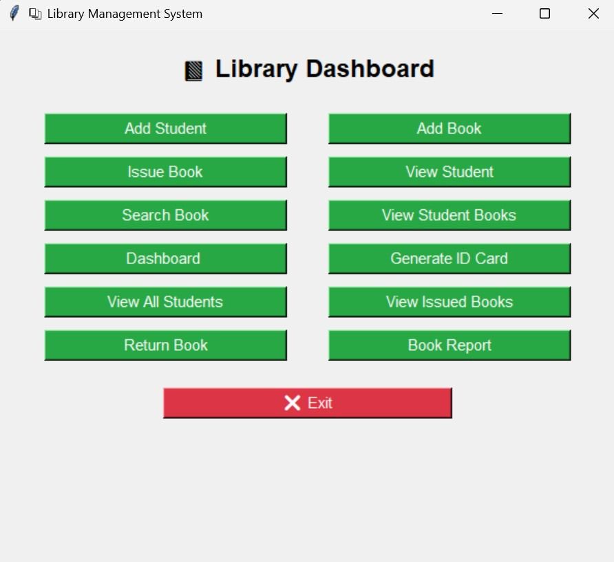

# 📚 Library Management System

A full-featured Library Management System using Python and MySQL.  
Provides functionalities to manage books, students, and book issue/return operations, plus reports and barcodes.

---

## 🚀 Features
- Add, update, delete books  
- Register and manage students  
- Issue and return books  
- Search books & students  
- View reports (books, issued books, students)  
- Generate barcodes for books  
- Export reports / print ID cards via HTML template  

---

## 📸 Project Screenshot  



## 🛠 Installation & Usage

1. Clone this repository:  
   ```bash
   git clone https://github.com/udhav996/Liabrary_management_system.git
   cd Liabrary_management_system
   
Install dependencies:

pip install -r requirements.txt


Set up the MySQL database:

Open MySQL Workbench / CLI.

Run the schema file:

mysql -u your_username -p < schema.sql

🗄️ Database Schema

The database will automatically create the following tables:

students → Stores student details & library IDs

books → Stores book details with barcode & availability

issued_books → Tracks which student has borrowed which book

logs → Keeps activity logs

users → Authentication for login

See schema.sql
 for full schema details.
Use db_config.py to add your MySQL credentials (host, user, password, database name)

Run the program:

python main_menu.py

📦 Project Structure
Library_management_system/
│── db_config.py            # MySQL configuration (avoid hardcoding credentials)
│── main_menu.py            # Entry point to the program
│── add_book.py             # Add new books
│── add_student.py          # Add student records
│── issue_book.py           # Issue books to students
│── return_book.py          # Return books functionality
│── search_book.py          # Search functionality
│── view_all_students.py    # List students
│── view_issued_books.py    # View issued books
│── view_student.py         # View student details
│── view_student_books.py   # View specific student’s books
│── book_report.py          # Generate reports
│── barcode_utils.py        # Utilities to generate barcodes
│── templates|
             |--id_card_template.html    # Template for ID cards
│── requirements.txt
│── README.md
│── .gitignore
│── asset/                 # (optional) for logos,images etc.

